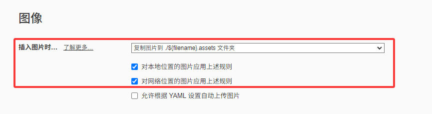

# 游戏试做协作仓库

## 项目规范

[项目规范](./standard.md)

## 目前设计

[目前设计](./design.md)

## 关于仓库

* 程序大佬可以fork作为单独项目进行协作

* 小白请选修相关技能
  * 代码团队协作与版本管理
    * [git与GitHub的基本使用教程](https://www.bilibili.com/video/BV1wm4y1z7Dg/?spm_id_from=333.337.search-card.all.click&vd_source=5f0f8adc7e5d3bc7e86930bcb6e1e799)
    * [sourceTree的基本使用](https://www.bilibili.com/video/BV18h411B7tc/?spm_id_from=333.337.search-card.all.click&vd_source=5f0f8adc7e5d3bc7e86930bcb6e1e799)
    * [如何使用 Git 进行多人协作开发（全流程图解）](https://blog.csdn.net/whc18858/article/details/133209975)
    
  * 文档
    * 高级记事本：markdown：https://www.runoob.com/markdown/md-tutorial.html 推荐使用免费版的typora进行编写，图片位置请设置到文件夹内便于结构管理（或暂时不添加图片）
    
      
    
    * 流程图、类图、uml图绘制工具：draw.io：https://zhuanlan.zhihu.com/p/661644046

